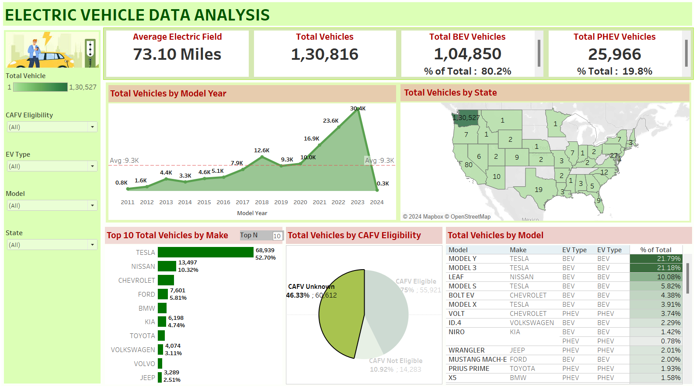

# Visualization Tool for Electric Vehicle Charge and Range Analysis

## Project Overview

This project focuses on analyzing Electric Vehicle (EV) charging patterns, battery performance, and model efficiency using Tableau dashboards and data analytics.

The system collects EV-related data and visualizes it through interactive dashboards to provide insights into:

* Charging usage patterns
* Battery performance vs driving range
* Comparative EV model efficiency

These insights help city planners, fleet managers, and consumers make data-driven decisions regarding EV adoption and infrastructure planning.

---

## Objectives

* Analyze EV charging behavior and peak usage hours
* Monitor battery health and driving range
* Compare EV model efficiency
* Build interactive dashboards using Tableau
* Integrate dashboards with a web interface using Flask

---

## Use Case Scenarios

### Scenario 1: Charging Pattern and Usage Analysis

City planners can analyze:

* Charging time trends
* Power consumption
* High-demand charging locations

This helps optimize electric grid stability and charging infrastructure planning.

---

### Scenario 2: Battery Performance vs Driving Range

Fleet managers can track:

* State of charge
* Battery efficiency
* Predicted vs actual driving range

This helps identify battery degradation and maintenance needs.

---

### Scenario 3: EV Model Efficiency Comparison

Consumers can compare EV models based on:

* Range
* Charging cost
* Efficiency
* Environmental impact

This helps users make eco-friendly vehicle choices.

---

## Technologies Used

* Tableau (Data Visualization)
* Python
* Flask
* SQL Database
* Pandas
* HTML / CSS

---

## Features

* Interactive Tableau dashboards
* EV charging heatmaps
* Battery performance tracking
* Model efficiency comparison
* Data filtering and dynamic analysis
* Web integration using Flask

---

## Project Architecture

1. Data Collection
   EV datasets collected from open data sources.

2. Data Storage
   Data stored in a structured database.

3. Data Preparation
   Cleaning and transformation of data.

4. Data Visualization
   Tableau visualizations created from processed data.

5. Dashboard Creation
   Multiple visualizations combined into interactive dashboards.

6. Web Integration
   Tableau dashboards embedded into a Flask web application.

---

## Dashboard Components

* Charging Time Distribution
* Charging Duration Analysis
* Battery State of Charge
* Range Prediction vs Actual Range
* EV Model Efficiency Comparison

---

## Performance Testing

* Data filters optimization
* Calculated fields implementation
* Dashboard responsiveness
* Efficient rendering of large datasets

---

## Web Integration

Tableau dashboards are embedded into a Flask web interface allowing users to interact with visualizations through a browser.

---

## Team Members

* Varun Kushwah (Team Lead)
* Tulika Anand
* Vivek Chauhan

---

## Dashboard Preview

Example:

---

## Future Improvements

* Real-time EV charging data
* Machine learning for range prediction
* Integration with IoT charging stations
* Advanced predictive analytics

---

## License

This project is created for educational purposes under the SkillWallet Program.

---
